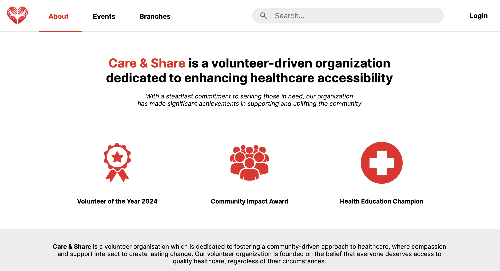

## Care and Share

Care & Share is a volunteer organisation dedicated to fostering a community-driven approach to healthcare, where compassion and support intersect to create lasting change. Our volunteer organization is founded on the belief that everyone deserves access to quality healthcare, regardless of their circumstances.

<div style="text-align:center;">
    <h4>Homepage</h4><br>
    
</div>
<div style="text-align:center;">
    <h4>About Us</h4><br>
    
</div>

## Features

There are 4 types of users in Care and Share:

1. Visitors (those who have not signed up/logged in)
2. Members
3. Branch managers
4. System admins

| Feature                    | Visitors             | Members        | Managers  | Admins |
| -------------------------- | -------------------- | -------------- | --------  |--------|
| Sign Up                    | ✅                   | ✅              | ✅        |✅      |
| Login                      | ✅                   | ✅              | ✅        |✅      |
| Logout                     | ❌                   | ✅              | ✅        |✅      |
| Google OAuth               | ❌                   | ✅              | ✅        |✅      |
| Change Password            | ❌                   | ✅              | ✅        |✅      |
| Announcements              | ❌                   | ✅              | ✅        |✅      |
| Search events              | ✅                   | ✅              | ✅        |✅      |
| View all branches          | ✅                   | ✅              | ✅        |✅      |
| View branch's details      | ✅                   | ✅              | ✅        |✅      |
| Join a branch              | ❌                   | ✅              | ❌        |❌      |
| Event RSVP                 | ❌                   | ✅              | ❌        |❌      |
| View branch members        | ❌                   | ❌              | ✅        |✅      |
| View RSVP for events       | ❌                   | ❌              | ✅        |✅      |
| Create new events          | ❌                   | ✅              | ✅        |✅      |
| Create new announcements   | ❌                   | ❌              | ✅        |❌      |
| View public events         | ✅                   | ✅              | ✅        |✅      |
| View private events        | ❌                   | ✅              | ✅        |✅      |
| Delete users               | ❌                   | ❌              | ❌        |✅      |
| Add users                  | ❌                   | ❌              | ❌        |✅      |
| Edit user's information    | ❌                   | ✅              | ✅        |✅      |
| Edit event's details       | ❌                   | ❌              | ✅        |✅      |
| Edit branch's details      | ❌                   | ❌              | ✅        |✅      |
| Email notification         | ❌                   | ✅              | ❌        |❌      |
| Create new branch          | ❌                   | ❌              | ❌        |✅      |
| Assign users as managers   | ❌                   | ❌              | ❌        |✅      |
| Sign up other admins       | ❌                   | ❌              | ❌        |✅      |

## Installed Packages
The project uses a variety of npm packages for different purposes. Here are some notable ones:

- **express**: A web application framework for Node.js.
- **vue**: A JavaScript framework for building user interfaces.
- **nodemon**: A utility that monitors changes in your source code and automatically restarts your server.
- **mySQL**: Node.js drivers for MySQL.
- **bcrypt**: A library to help in hashing passwords.
- **nodemailer**: A module to send emails from Node.js.
- **multer**: A middleware for handling multipart/form-data, which is primarily used for uploading files.
- **body-parser**: Parse incoming request bodies in middleware before your handlers.
- **cookie-parser**: Parse Cookie header and populate req.cookies with an object keyed by the cookie names.
- **express-session**: Create a session middleware with the given options.
- **debug**: A debugging utility for Node.js applications, enabling selective debug output control.
- **dotenv**: Loads environment variables from a .env file into process.env for Node.js applications.
- **google-auth-library**: Provides APIs for integrating Google authentication mechanisms into Node.js applications.
- **morgan**: HTTP request logger middleware for Node.js applications, logging incoming requests.
- **remixicon**: A set of open-source icons designed for modern web and mobile applications.
- **uuid**: Generates universally unique identifiers (UUIDs) according to RFC standards for Node.js applications.

## Usage

To install all the npm Packages, run:
```
npm install
```

In order to have the latest database version for proper functioning, import it into MySQL. Please note that mysql must be running before hand `service mysql start`. Execute the following command:
```
mysql < db/CareAndShare.sql
```

Then you can run the project on localhost using the following command:
```
npm start
```
